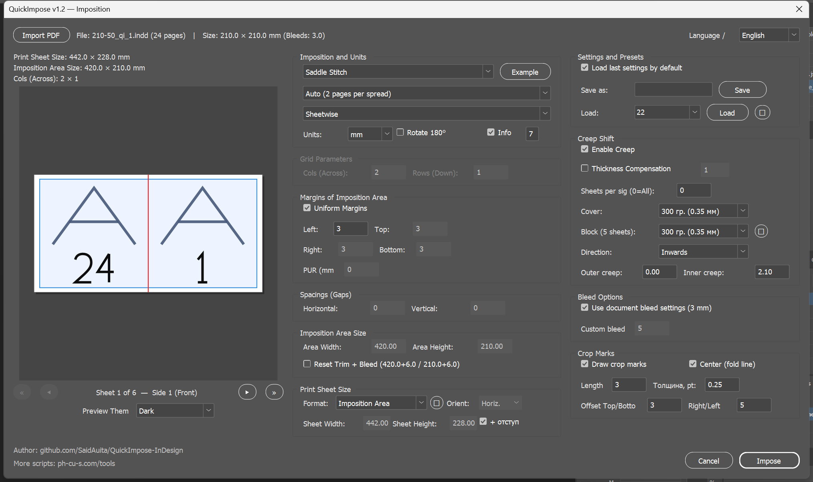
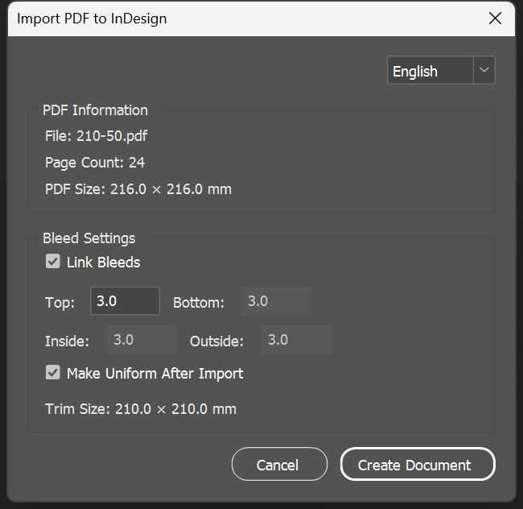

# QuickImpose v2.0

**QuickImpose** is a professional, fast, and feature-rich ExtendScript script for sheet imposition in Adobe InDesign and PDF documents. It supports modern versions of InDesign (tested on version 2026).

*Figure 1: Full Interface with Interactive Live Imposition Scheme (`QuickImpose_v2.jsx`)*

*Figure 2: Dedicated PDF Import Interface (`PDF_Import.jsx`)*

---

## 🚀 What's New in v2.0

* **Single Unified Script**: The core script has been consolidated into `QuickImpose_v2.jsx`, providing a single, powerful interactive interface.
* **Standalone PDF Import**: A dedicated module, `PDF_Import.jsx`, for quickly importing and scaling multi-page PDF documents.
* **Interactive Live Scheme Canvas**: Real-time canvas rendering of sheets, imposition bounds, margins, gaps, page cell numbers, and vector orientation marks.
* **Spine Visualization**: The live preview now visually renders the spine (PUR/Perfect Bound hinge) for book impositions, making it easier to verify creep and spacing adjustments.
* **Expanded Localization**: Full support for translations on the fly without breaking UI formatting, including 10 built-in languages.
* **Preset Management (🗑)**: Easily load, save, and delete saved presets with a single click and confirmation safety dialog.

---

## 🚀 Key Features (English)

### 1. Imposition Modes
* **Saddle Stitch**: Imposition for booklets bound with staples. Automatically gathers reader spreads, supports multi-signature setups, and handles bleed.
* **Perfect Bound (КБС)**: Imposition for adhesive binding. Splits the document into signatures of a specified sheet count (e.g., 16 or 32 pages), forming spreads without creep shifts.
* **N-Up Consecutive**: Sequentially lays out pages in a grid (columns × rows) from left to right, top to bottom.
* **Cut Stack**: Lays out pages in stack order. Designed for print runs that are cut in blocks and stacked on top of each other in correct numerical order.
* **Step & Repeat (Repeat)**: Repeats the same layout (e.g., business cards or labels) on a sheet. Spacings are automatically padded with bleed sizes to facilitate double cuts. Convenient to use as a 2nd step after Saddle Stitch or Perfect Bound imposition using the "Reset Trim + Bleed" option.

### 2. Smart Spacing & Bleeds (Bleed & Spacing Math)
* Automatically imports bleed sizes from the source document.
* In Grid and Repeat modes, the script dynamically adds the total bleed to the column/row spacing (e.g., for a `180×50` mm card with `2` mm bleed, the vertical placement step is set to exactly `54` mm), ensuring bleeds touch without overlapping.
* In Saddle Stitch and Perfect Bound booklet modes, the inner bleed at the spine is automatically clipped to `0 mm` for a correct fold.

### 3. Creep & Thickness Compensation
* Automatically calculates sheet creep shifts based on paper thickness and signature size.
* Embedded paper presets database (`PaperWeights.txt`) with custom editing support.
* **Thickness Compensation** option: automatically shifts the cover page outwards by $OffsetMax = (Thickness / 2) \times K$, where $K$ is a customizable coefficient (default `1.0`), ensuring the cover is perfectly centered.

### 4. "Reset Trim + Bleed" Option
* Available in Saddle Stitch mode.
* Automatically resizes the imposition sheet to the trim size of the booklet and writes the source document's bleed parameters into the page layout bleed settings.
* Automatically centers all items (including pasteboard marks and crop lines) geometrically.

### 5. Crop & Fold Marks
* **Crop Marks**: Drawn with a thin 0.25 pt stroke using the `Registration` color. Booklets receive outer boundary marks only (no spine cuts), while grids get double crop marks inside the bleed gaps.
* **Fold Lines**: Specially thickened lines (1.0 pt) drawn at the spine or page centers to assist fold operations.

### 6. Info Slug
* Automatically generates a job info line in the top-left corner of the page (File name, card size, flat index, imposition type, date/time).
* Placed in the pasteboard area for Reset mode and inside margins for standard sheets, preventing overlap with the artwork.

### 7. Localization & Presets
* Native support for **10 languages** (Russian, English, Deutsch, Français, Español, Italiano, Português, Polski, 中文, 日本語).
* Automatic English fallback for missing localization keys.
* Saves session options automatically and supports custom named presets.

---

## 🛠 Installation & Usage

1. Copy the `.jsx` scripts (`QuickImpose_v2.jsx` and `PDF_Import.jsx`) and the `RESOURCES` directory to your Adobe InDesign scripts panel directory:
   * **Windows**: `C:\Users\<Username>\AppData\Roaming\Adobe\InDesign\Version <Version>\ru_RU\Scripts\Scripts Panel\`
   * **macOS**: `/Users/<Username>/Library/Preferences/Adobe InDesign/Version <Version>/ru_RU/Scripts/Scripts Panel/`
2. Open the document you want to impose in Adobe InDesign.
3. Open the **Scripts** panel (Window -> Utilities -> Scripts).
4. Double-click `QuickImpose_v2.jsx` (or run `PDF_Import.jsx` to load an external PDF).
5. Configure your layout and click **Impose** / **Import**.

---
---

## 🇷🇺 Описание на русском языке (Russian)

**QuickImpose** — это профессиональный, быстрый и многофункциональный ExtendScript-скрипт для автоматизации спуска полос (imposition) в Adobe InDesign.

### 🚀 Что нового в v2.0

* **Единый скрипт**: Базовая версия и компактный интерфейс объединены в один мощный скрипт `QuickImpose_v2.jsx`. 
* **Отдельный импорт PDF**: Отдельный, оптимизированный модуль `PDF_Import.jsx` для удобной загрузки многостраничных PDF-файлов.
* **Интерактивная схема спуска в реальном времени**: Живой холст визуализации листа, границ спуска, полей, зазоров, нумерации полос и векторной ориентации страниц.
* **Визуализация корешка**: На интерактивной схеме спуска теперь визуально отображается корешок (клеевой слой PUR/КБС), что позволяет легко контролировать отступы и компенсацию сползания.
* **Улучшенная локализация**: Поддержка мгновенного переключения языка "на лету" без сбоев верстки для 10 языков.
* **Управление пресетами (🗑)**: Удобное сохранение, загрузка и удаление пользовательских настроек с подтверждением безопасности.

### 🚀 Основные возможности

#### 1. Режимы спуска
* **Saddle Stitch (Скрепка)**: Спуск под буклет скреплением на скобу. Автоматически собирает развороты, учитывает разбиение на тетради и поддерживает вылеты.
* **Perfect Bound (КБС)**: Спуск под клеевое бесшвейное скрепление. Разбивает документ на тетради заданного объема, формируя развороты без сдвигов сползания.
* **N-Up Consecutive (Сетка)**: Последовательная раскладка страниц в сетку слева направо, сверху вниз.
* **Cut Stack (Порезка стопой)**: Раскладка страниц стопами. Удобно для тиражей, которые режутся блоками и складываются стопкой друг на друга в правильном порядке.
* **Step & Repeat (Повтор)**: Повторение одного и того же макета (или визиток/карточек) на листе. Зазоры автоматически увеличиваются на величину вылетов для удобной двойной резки. Удобно использовать как 2 шаг после спуска на скобу или КБС с использованием опции (Сбросить Trim + Bleed)

#### 2. Умное управление зазорами и вылетами
* Автоматически импортирует размеры вылетов из исходного документа.
* В режимах сетки и повтора автоматически добавляет размер вылета к шагу размещения макетов, исключая наложение графики.
* В режиме книги («Скрепка» / КБС) вылеты по корешку автоматически обрезаются (`0 мм`).

#### 3. Компенсация сползания и центрирование (Creep & Thickness Compensation)
* Автоматический расчет сползания страниц с учетом толщины бумаги.
* Предустановленная база плотности бумаги (`PaperWeights.txt`) с возможностью редактирования.
* Функция **Thickness Compensation** (Компенсация толщины блока): гарантирует центрирование обложки по корешку книги при печати плотными блоками.

#### 4. Опция «Reset Trim + Bleed» (Сбросить Trim + Bleed)
* Позволяет автоматически уменьшить формат листа готового спуска до обрезного формата книги и перенести вылеты исходного макета в параметры страницы Flat-документа.

#### 5. Метки реза и сгиба (Crop & Fold Marks)
* **Обрезные линии**: Отрисовываются тонким штрихом цветом `Registration`.
* **Линии сгиба**: Специальные утолщенные линии по центру разворотов/корешка для удобства фальцовки.

#### 6. Служебная информация (Info Slug)
* Автоматический вывод информационной строки в углу листа (Имя файла, размер макета, номер печатного листа, тип спуска, дата, время). Никогда не перекрывает макет.

#### 7. Локализация и Сохранение настроек
* Поддержка **10 языков** (Русский, English, Deutsch, Français, Español, Italiano, Português, Polski, 中文, 日本語).
* Сохранение параметров сессии и поддержка именованных пресетов.

---

## 📄 Лицензия (License)
Проект распространяется по свободной лицензии MIT. Вы можете использовать, дорабатывать и изменять данный скрипт без ограничений.
